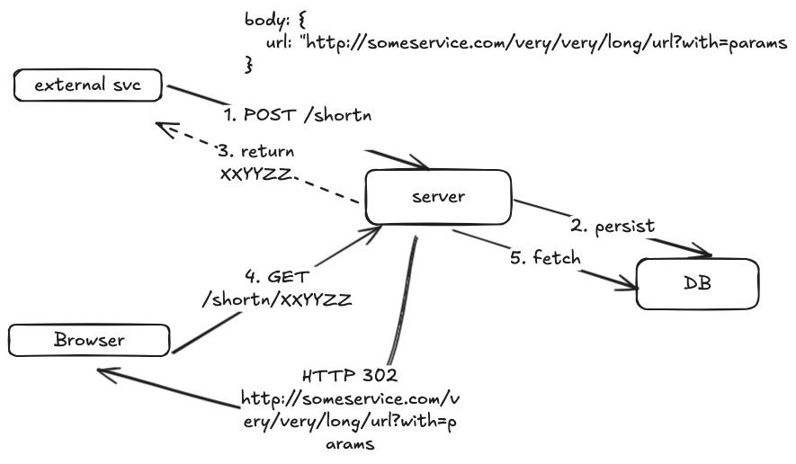
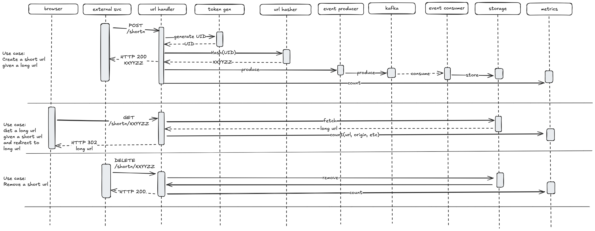
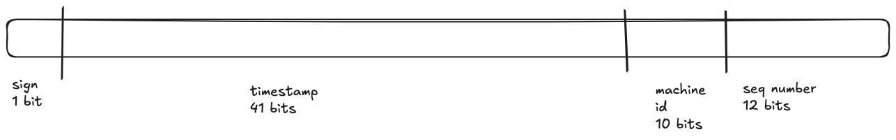

# Url Shortener

This project takes a long url and applies a hashing function to reduce it's size. The short url is the result of generating an unique token 
and hashing it using a custom function.

The client may then get the long url by requesting it by short url, and the response will redirect the client to the long url. 
This is done using HTTP 302 (moved temporarily) so we don't get cached by the browser and we allow ALL request to arrive to the server.

The client may also delete a long url stored by it's short url.

## General idea



## Sequence Diagram

Here we can see all the components that in the end take part of the three use cases



## Token Generator

Since this logic should work in a distributed environment, after reading about options available, opted for an approach based on the one created by Twitter in their Snowflake project, even though it is slightly different in some fields.
This approach uses a 64-bit ID compound by these fields


## Hash Generator

Once we get an unique token, we need to hash that 64-bit to a shorter string. This string will contains lower case characters (a-z), upper case characters (A-Z) and numbers (0-9).
This charset combined offers 62 chars, which I use as the base to use to build this hash. The mechanism works by dividing the number by 62 and taking the result and the remainder. The remainder must be at most 62, therefore it's in the charset, and we take recursively the result until it is no longer able to be divided by 62. By appending the translation of the remainders using the charset, we can form a shorter version of the input.

Example: 

- 1000000/62 = 16129
- 1000000%62 = 2 -> b
- 16129/62 = 260
- 16129%62 = 9 -> i
- 260/62 = 4 -> no longer divisible by 62. We stop here!
- 260%62 = 12 -> l

This means we should be able to express 1000000 in the base 62 as an string "bil"

Using a smaller charset would generate larger urls, since the goal of this project is to make them smallers, opted for this charset as resulting urls are also valid for browsers.

## Storage

This project should deal with a large amount of requests per second, and since the urls may be used for temporal campaigns, I decided to use Redis for storing the urls. Redis is super efficient for this purpose and given I don't need very hard ACID constraints for this info, it made sense to use it. Other options could have been some other no-sql db engine (MongoDB - Cassandra), or even some relational DB engine (mysql - postgresql), but considering pros and cons on each one, opted for Redis.

## Metrics

This project uses 3 metrics:

- http_requests_total ("method", "endpoint", "url")
- http_requests_errors ("method", "endpoint", "url")
- http_request_duration_seconds ("method", "endpoint")

These metrics are published to a local Prometheus that is started with docker-compose, and acts as source for Grafana.

- Prometheus:
  - http://localhost:9090/ -> Prometheus dashboard
  - http://localhost:8080/metrics -> Prometheus metrics
  - http://localhost:3000/dashboards -> Grafana dashboard (user: admin - password: admin)

## How to run this

This project uses a docker-compose with the required components:
```text
docker-compose up --build 
```

## Sample requests

#### Getting a shortened url

request
```http request
curl --location --request POST 'http://localhost:8080/shortn' \
--header 'Content-Type;' \
--data-raw '{
    "url": "http://mercadolibre.com.ar"
}'
```
response
```json
{"short_url":"1EfiApFZs18"}
```

#### Getting a long url by shortened url

request
```http request
curl --location --request GET 'http://localhost:8080/shortn/1EfiApFZs18' \
--header 'Content-Type;' \
--data-raw ''
```

response
```text
you will receive an html
```

#### Deleting a short url

request
```http request
curl --location --request DELETE 'http://localhost:8080/shortn/1EfiApFZs18' \
--header 'Content-Type;' \
--data-raw ''
```

response
```text
HTTP Status OK
```